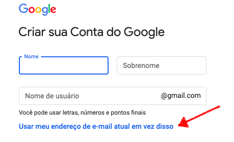

#  |  ANTAQ Pro 

## Configurando o Google Spreadsheets como uma base de dados

Para que você possa compartilhar seus projetos com sua equipe, utilizando uma planilha online no Google Spreadsheets como base de dados.

Dessa forma seus dados estarão protegidos pela camada de segurança do Google e sempre ao seu alcance.

Por isso, antes de iniciar a criação do banco de dados recomendamos criar uma conta Google utilizando seu email institucional. 

Dessa forma seu banco de dados ficará separada de sua conta pessoal do Gmail.

## Criando uma conta Google

> [Criar sua Conta do Google agora](https://accounts.google.com/SignUp)
>
> [Suporte Google: Como criar uma Conta do Google usando um endereço de e-mail existente](https://support.google.com/accounts/answer/27441?hl=pt)

>  

## Criando o banco de dados
Depois de logado em sua nova conta Google, crie uma cópia do nosso banco de dados clicando no modelo de planilha abaixo:

> [https://docs.google.com/spreadsheets/d/1N3SFN80rc0Lgwvg8iKoH6KLk3VdMADUSaFsAkIeoRIo/copy](https://docs.google.com/spreadsheets/d/1N3SFN80rc0Lgwvg8iKoH6KLk3VdMADUSaFsAkIeoRIo/copy)

Clique em **"Fazer uma cópia"**

>  

### ID da planilha

Anote o ID da sua planilha, você precisará dele para [Conectar o ANTAQ Pro ao Google Spreadsheets](../pages/SEISHEETS.md)

>  

### Configurando o Google Sheets API

Utilizamos a API do Google Sheets para acessar sua planilha de dados e gravar as informações necessárias da ferramenta. 

Para iniciar a configuração dessa API, acesse o **"Google Cloud Plataform"** e crie um novo projeto:

> [https://console.cloud.google.com/home/dashboard](https://console.cloud.google.com/home/dashboard)

## Criando um projeto

Clique no botão **Criar projeto**

No campo **"Nome do Projeto"** insira **"ANTAQ Pro"**. Por fim, clique em **Criar**

>  

>  

## Ativando o Google Sheets API

Na barra lateral, acesse o menu **"API e Serviços"** > **"Biblioteca"**

>  

Procure pelo termo **"Google Sheets API"**, ative a API

>  

## Criando tela de consentimento

Para que a aplicação possa manipular sua planilha de dados, o Google precisará exibir uma tela de consentimento para o usuário, perguntando se ele autoriza que o aplicativo acesse a planilha compartilhada.

Para criá-la, acesse na barra lateral o menu **"API e Serviços"** > **"Tela de consentimento OAuth"** ou utilize o link abaixo:

> [https://console.cloud.google.com/apis/credentials/consent](https://console.cloud.google.com/apis/credentials/consent)

Selecione a modalidade **Externo**

>  

No campo **"Nome do Aplicativo"** insira **"ANTAQ Pro"**

>  

No campo **"Domínios autorizados"** insira o domínio onde está hospedado o **SEI!** do seu órgão ou entidade. Não utilize **www**, **https** ou **/**

Isso irá garantir que sua planilha só poderá ser acessada por scripts gerados dentro do domínio do seu órgão ou entidade.

>  

Clique em **Criar**

## Criando credenciais de acesso

Após ativar a API, criar a tela de consentimentos, agora será preciso gerar credenciais de acesso para usar a API
Essas credenciais permitiram que os usuários que a possuirem possa alterar a planilha remotamente.

Para isso precisaremos de um ID de Cliente e uma Chave de API

### Criando ID de Cliente

Clique no botão **"Criar credenciais"** > **"ID do cliente do OAuth"**

>  

No campo **"Tipo de aplicativo"**, selecione **"Aplicativo da Web"**

No campo **"Nome"**, insira **"ANTAQ Pro"**

No campo **"Origens JavaScript autorizadas"**, insira o URL do **SEI!** do seu órgão ou entidade.

>  

Anote **"Seu ID de Cliente"**, você precisará dela no passo a passo [Conectar o ANTAQ Pro ao Google Spreadsheets](../pages/SEISHEETS.md)

>  

### Criando Chave de API

Clique no botão **"Criar credenciais"** > **"Chave de API"**

>  

Anote **"Sua Chave de API"**, você precisará dela no passo a passo [Conectar o ANTAQ Pro ao Google Spreadsheets](../pages/SEISHEETS.md)

>  

Clique em **"Rentringir Chave"** para limitar o acesso das credenciais ao estritamente necessário para a aplicação

Nas **"Restrições do aplicativo"**, selecione **"Referenciadores de HTTP (sites da Web)"**

>  

Em **"Restrições de sites"**, clique em **"Adicionar um item"** e insira o URL do **SEI!** do seu órgão ou entidade.

>  
  
### Publicando o aplicativo

Antes de utilizar a API do Google, é necessário publicar a **Tela de consentimento OAuth**.

No menu lateral, acesse **"Tela de consentimento OAuth"** > **"Status da publicação"** e clique em **"Publicar Aplicativo"**

>  
  
**ATENÇÃO!** Caso o acesso ao SEI do seu órgão não utilize o protocolo seguro HTTPS, API do Google não funcionará em ambiente de produção. Nesse caso, ignore o passo anterior e utilize o aplicativo em ambiente de teste. 

Para verificar qual protocolo utilizado pelo SEI do seu órgão, clique sobre o cadeado na barra de endereços do navegador.

>  
  
Em ambiente de testes todos os utilizadores da base de dados precisam ser cadastrados no console de API do Google. Para isso, ainda na tela de **"Tela de consentimento OAuth"** vá para a seção **"Usuários de teste"** e adicione os emails dos usuários que utilização o Gestor de Projetos.

>  

## Próximo item

[Conectar o ANTAQ Pro ao Google Spreadsheets](../pages/SEISHEETS.md)
