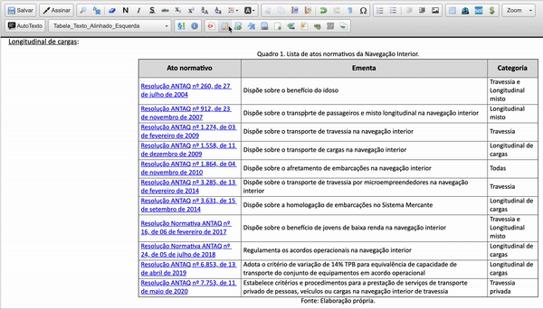

#  |  ANTAQ Pro 

##  Adicionar estilo a tabela 

Essa funcionalidade adiciona ao editor de texto do SEI a edição de estilo a tabelas.

>  

## Próximo item

> [Adicionar link de legislação](./LINKLEGIS.md)
