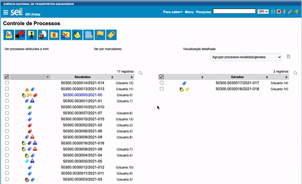

#  |  ANTAQ Pro 

##  Histórico de processos visitados

Essa funcionalidade adiciona ao SEI a consulta ao histórico de processos visitados pelo usuário

>   

A lista de processos visitados não mostra o histórico de acessos antes da instalação do ANTAQ Pro, tampouco acessa o histórico de visitas de seu navegador.

## Próximo item

> [Informações adicionais na árvore do processo](../pages/INFOARVORE.md)
