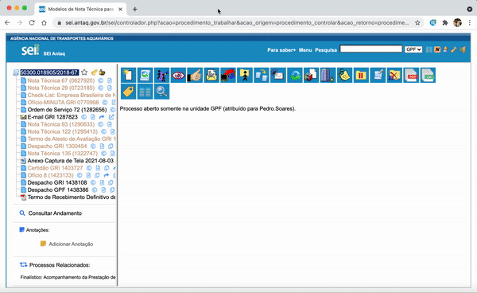

#  |  ANTAQ Pro 

##   Redimensionar automaticamente a árvore do processo pela sua largura total

Essa funcionalidade redimensiona automaticamente a árvore do processo pela sua largura total

>   

## Próximo item

> [Utilizar caixas de seleção inteligentes](../pages/SUBSTITUIRSELECAO.md)
