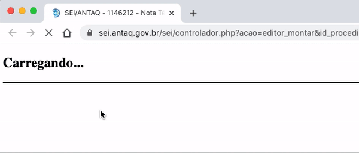

#  |  ANTAQ Pro 

##  Alterar título da página

Essa funcionalidade altera o título da página do SEI, personalizando com o assunto e número do processo.

>  

Nenhuma ação é requerida. Ao instalar a extensão o título da página é alterado no seguinte padrão: 

|  Página do SEI  |  Formato |
| ------------------- |  ------------------- | 
|  Árvore de Processo |  `(Assunto do Processo)`  `ANTAQ Processo (Número do Processo)`  |
|  Edição de Documento |  `Editor:` `(Tipo de Documento)` `(Número SEI do Documento)` - `(Assunto do Processo)` `ANTAQ Processo` `(Número do Processo)`  |

## Próximo item

> [Abrir, editar e remover hiperlinks](../pages/ABRIRLINKS.md)
