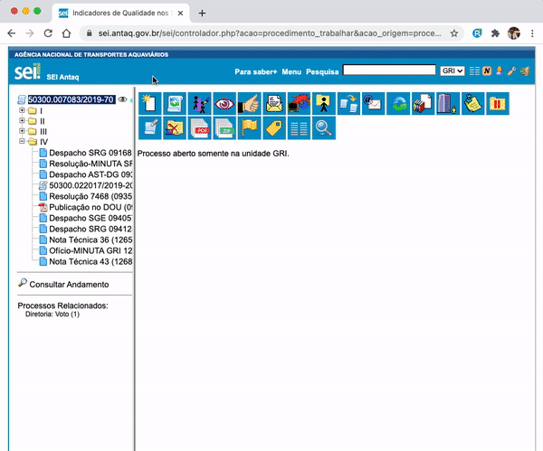

#  |  ANTAQ Pro 

##  Adicionar valores padronizados ao criar um novo documento

Essa funcionalidade adiciona valores padronizados ao criar um novo documento.

Acesse as opções da extensão e selecione os valores disponíveis para padronização. 
Ao criar um novo documento os valores são adicionados automaticamente.

>  

## Próximo item

> [Pesquisar link permanente](../pages/LINKPERMANENTE.md)

